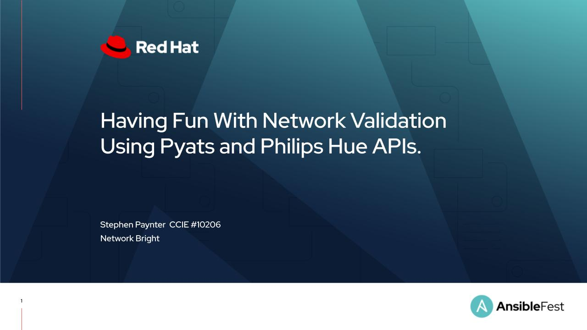
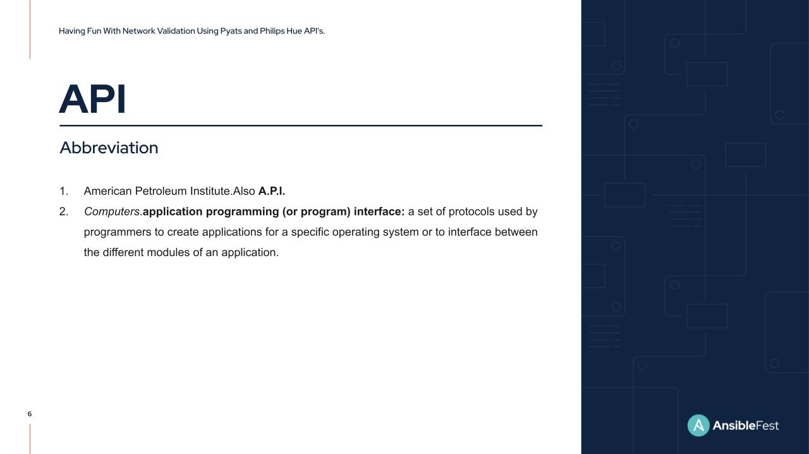
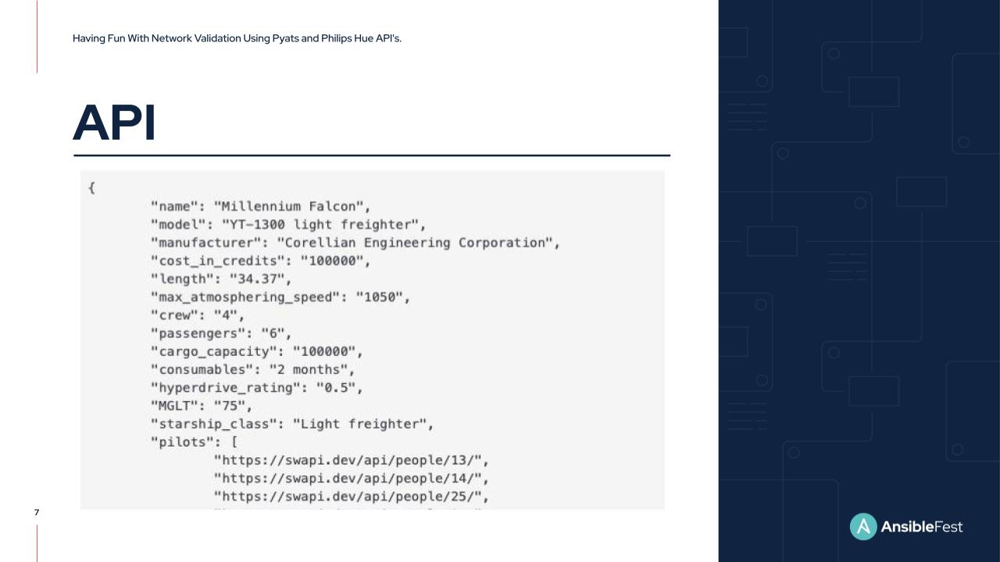
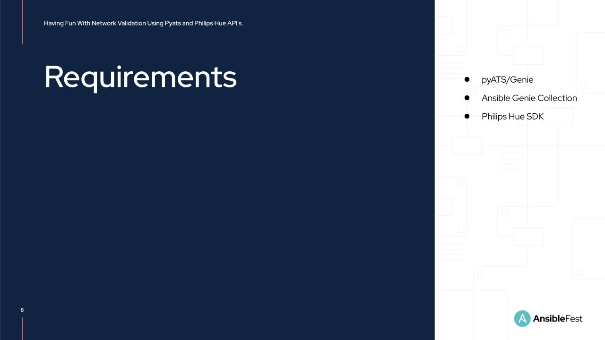
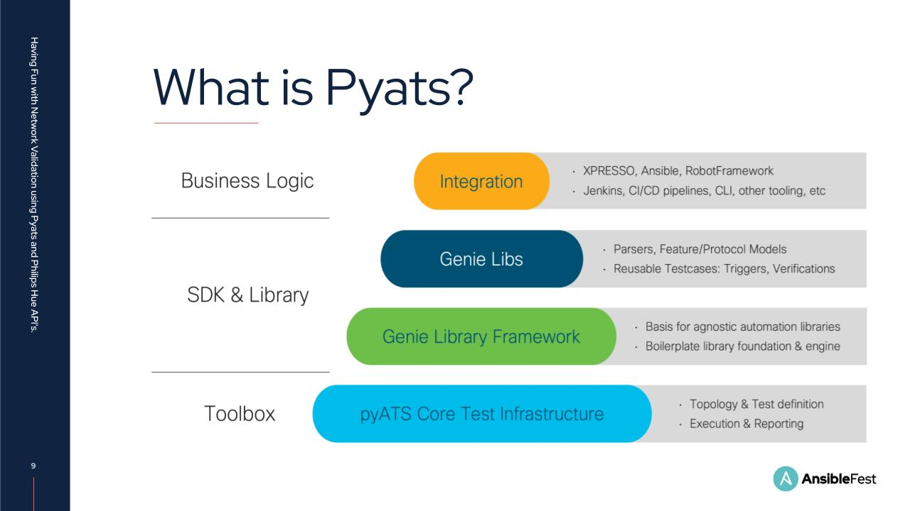
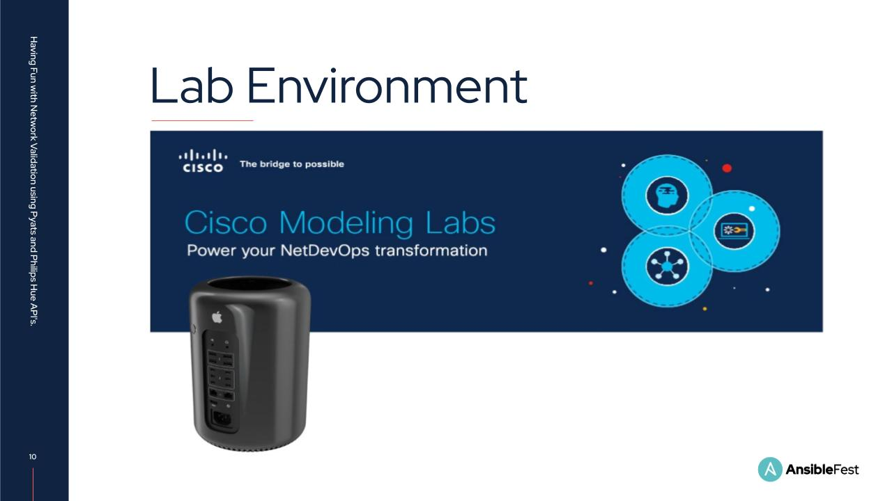
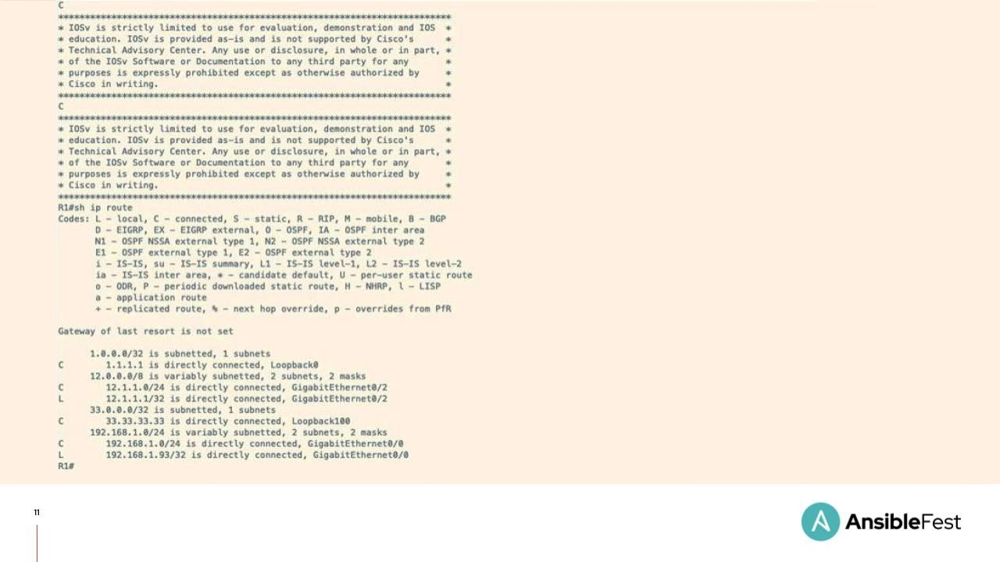

# Having Fun with Network Validation using Pyats and Phillips Hue APIs

## Overview

This repository serves as an example, and overview of the workflow presented at Ansiblefest Chicago 2022, which leverages Ansible, Python and Pyats to leverage the Philips Hue Api for Network Validation.

> Note that the code in this repository can be used as a reference but will need modifications to work within your environment.

## Presentation

Traditionally network engineers have interfaced with devices using the command line interface. Gathering network state was a wieldy task involving trawling pages of configuration. Checking routes, neighbours and interface states was time consuming and error prone. Automation is changing the landscape of network management and configuration. We can easily create repeatable tasks that eliminate human error and reduce toil. Today Im going to show you how I gather structured data from Cisco devices using Pyats. I’ll then use the data I gather to perform network state validation and trigger API calls with Ansible.  
Hopefully this session will be a bit of fun and a little outside the box, the API’s I use will be directed at my Phillips Hue lights turning them on when a desired state is reached.  However, most of these techniques and code can be used when automating at scale in production environments, The code could easily be modified and built upon to trigger alarms and alerts in many customer networks using Ansible. For example instead of playing with visual cues we could easily trigger an alert in Slack or an email to the Ops team with some simple code amends.

Who am I? My name is Stephen Paynter. I’m based in the North East of England and have been a network engineer for over 25 years, predominantly working as an IT contractor in both private and public sectors.  I’m a Cisco CCIE and full time automation engineer.  I am presently automating at scale with AAP,  Ansible core and Python.  
  
I’m on most social media platforms so if you have any questions or feedback from todays session then hit me up and I’d be happy to help.  All the code from this session is also available In my Github.  

2020, what happened, a lot yeah. At least everyone knew where Wuhan was on a map by the end of March.

For me personally what happened was I couldn’t do the hobbies I enjoyed. The UK like everywhere else mandated people stay at home. That meant no Surfing, wakeboarding,  Snowboarding or Mountain biking, Personally, that was giving up a lot. Being active and busy for me is like a fountain of youth, and im not really a happy bunny if I can’t do get my fix at least once or twice a week. A brief 30 minute walk during my lunch hour was the only thing keeping me marginally entertained.  
  
This wasn’t sustainable, I needed something to fill my personal time and keep me sane during lockdown. Luckily Cisco had just released their Devnet certification track. This seemed a perfect solution, I was already automating in my current role and this would only make me a better engineer and expose me to new technologies and products. So after a month of indecision I decided to pursue it,  but I wanted to make the process as fun as possible. I find the older I get the more I struggle to learn. I needed a way to stay engaged and motivated whilst ensuring I understood what I needed to learn. 

APIs are everywhere. There are so many public facing APIs available on the internet that anyone can interact with. 

Believe it or not there’s a Star Wars API, here’s the return response from a query made to the spaceship resource. You can also query planets, vehicles, people, films and species . NASA has an API that amongst other things will tell you how many people are currently in space or how many near earth objects are currently being tracked. Theres also API’s for football, beer, countries, dinosaurs, marvel comics, if you can think it, there’s probably an API out there for it. 

A lot of everyday devices also have API’s, pretty much everyone has access to an API in their home. Amazon Echo Dot, Google Chromecast, Nest smart Home, Apple HomeKit, Samsung smart things the list goes on and on.  If you pick a topic or product that interests you, then learning doesn’t seem as mundane or feel like its something you need to do.    
I have a couple of Phillips Hue lights which have a REST API. This got me thinking, would it be possible to turn them on when a certain network state was detected. What would be even cooler, would be to turn them to a specific colour based on my needs. I needed to work out a use case. What if Ansible were to check for a  specific number of routes in a device’s routing table and If the number of routes was correct, get the Hue lights to turn green. If the routes were incorrect get them to turn red. By doing this I’d figure out how to parse the device route table and  learn a little about the Hue’s REST API with the Ansible URI module.  

What needs to be installed?  
Well obviously Ansible and Python. Im currently running Ansible 2.10.6 and Python 3.6.8. We’ll also need……. 
pyATS and Genie libraries - available from the Cisco Devnet website. 
The Ansible Galaxy Cisco Genie Collection. - downloadable from galaxy.ansible.com. 
And finally the Phillips Hue Software Developer kit. - available from the Philips developer website. 

I keep mentioning pyATS, what is it?  

pyATS is the acronym for the Python Automation Test System, it’s a framework developed by in house by Cisco. It’s been designed to provide end-to-end testing for developers to create automated test cases which simplify network testing. It is the de-facto test framework for internal Cisco engineers running millions of CI/CD, sanity, regression, scale, HA, solution tests on a monthly basis.  

Genie is effectively the pyATS SDK and contains all the tools needed for Network Test Automation. Genie simplifies network automation and allows scripting and interaction with devices whilst avoiding functional programming. Genie has a huge library, but for the purpose of this presentation we will only be looking at the Genie Parser Library.  

My home lab environment is built using CML, or cisco modelling labs and simulates network equipment on a Virtual Machine. This lets me quickly and easily create and modify network scenario’s using Cisco and non-cisco equipment, using real images.  

As I mentioned before I want to get Ansible to check for a specific number of routes in a device’s routing table. I’m going to use R1 in my lab for this, its a Cisco IOSv router.  

Logging into router 1 I can see that there are a total of 6 subnets in the routing table, 4 of which are connected routes and 2 lof which are local routes. 2 of the connected routes are from loopbacks so they are perfect to use for testing functionality later.  Ideally I only want to know the number routes in the routes table. My home lab doesn’t really change so I don’t need to know the specific subnets.

